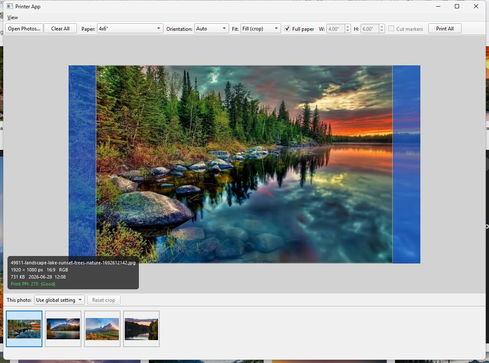

# EasyPhotoPrinterApp

*Because manually resizing and printing photos one-by-one is basically arts-and-crafts with extra suffering.*




## About

Printing photos to fixed paper sizes sounds simple until you need to handle mixed aspect ratios, orientation changes, crop control, and print quality checks without guessing. Most default print dialogs make this process far more manual than it needs to be.

This app provides a focused desktop workflow for loading multiple photos, previewing exactly what will print, controlling fit/crop behavior, and sending the full batch to the printer with consistent settings.

Repository: https://github.com/AdamMoses-GitHub/EasyPhotoPrinterApp

## What It Does

### The Main Features

- Loads multiple photos at once and displays selectable thumbnails.
- Previews a paper canvas with a centered print area before printing.
- Supports three fit modes: Fill (crop), Fit (letterbox), and Stretch.
- Allows per-photo fit overrides while keeping a global default.
- Lets you drag to pan crop position in Fill mode and reset crop per photo.
- Prints all loaded photos in one run, with optional auto orientation per image.

### The Nerdy Stuff

- Uses Qt's print stack (QPrinter/QPrintDialog/QPageLayout) with per-page orientation handling.
- Renders print images through Pillow with Lanczos resampling for quality.
- Caps effective print DPI to avoid extreme memory usage during rasterization.
- Persists user settings (paper, orientation, fit mode, custom area) via QSettings.
- Displays in-app metadata overlays including ratio, file stats, and effective print PPI quality.

## Quick Start (TL;DR)

Detailed setup and workflows: [INSTALL_AND_USAGE.md](INSTALL_AND_USAGE.md)

```bash
git clone https://github.com/AdamMoses-GitHub/EasyPhotoPrinterApp
cd EasyPhotoPrinterApp
python -m venv .venv
.venv\Scripts\activate
pip install PySide6 Pillow
python main.py
```

## Tech Stack

| Component | Purpose | Why This One |
|---|---|---|
| Python 3.13.2 | App runtime | Fast iteration, strong desktop tooling ecosystem |
| PySide6 6.11.0 | Desktop GUI and print integration | Native Qt widgets + robust printer APIs in one package |
| Pillow 12.2.0 | Image loading and rendering | Reliable format support and high-quality resizing/cropping |
| JSON config (`config/paper_sizes.json`) | Paper preset definitions | Easy to edit without touching code |
| QSettings | Local preference persistence | Cross-platform storage with minimal code |

## License

MIT (default). Update this section if your project uses a different license.

## Contributing

Pull requests are welcome. If you add features, include a short usage note and a screenshot/GIF so people can see the behavior quickly.

<sub>photo printing, batch photo print, PySide6 app, Pillow image processing, print preview, crop and pan, aspect ratio fit, letterbox printing, Qt printer, desktop GUI, paper size presets, cut markers, DPI quality, photo metadata, Windows printing, Python desktop app, print workflow, thumbnail browser, print area layout, image resize</sub>
